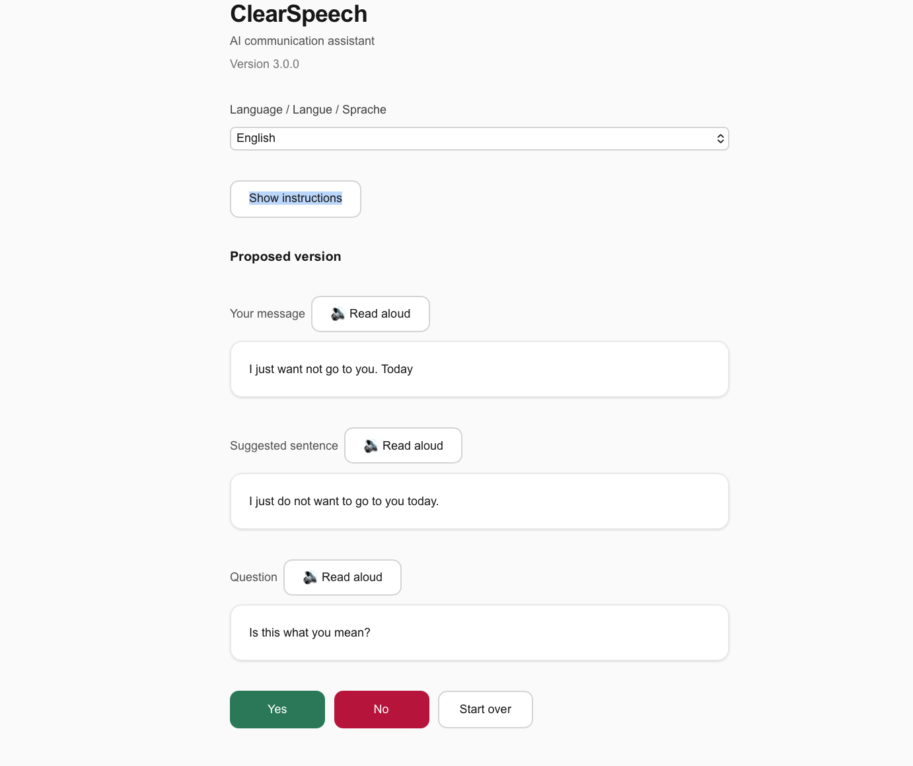

# ClearSpeech

**AI communication assistant for people who struggle to find the right words.**

I built ClearSpeech because I need it myself. I have aphasia — a neurological condition that makes writing difficult. Every day, I struggle to compose emails, messages, and even short texts. ClearSpeech takes my broken, incomplete input and turns it into a clear sentence I can actually use.

Over 2 million people in Europe alone live with aphasia. Millions more have cognitive difficulties or language barriers that make written communication a daily challenge. Most AI tools assume you can write a perfect prompt. ClearSpeech assumes you can't — and that's the point.

---

## Live app

| | URL |
|---|---|
| **Frontend** | https://clearspeech-app-v2.vercel.app |
| **Backend API** | https://clearspeech-backend.onrender.com |

> The backend runs on Render free tier. The first request after a period of inactivity may take about one minute while the server wakes up. This is normal.

**Current version:** `3.0.0`

---

## What it looks like



*The user typed "I just want not go to you. Today" — the app suggested "I just do not want to go to you today." and asks for confirmation.*

---

## How it works

1. You write a short message — a few words is enough, spelling does not need to be perfect
2. The app proposes a clearer sentence and asks: "Is this what you mean?"
3. You answer Yes or No
4. If No, you add one short clarification — the app updates the suggestion
5. When you are happy, you see the final text and can copy it

**Languages supported:** English, French, German

**Voice input (beta):** You can dictate your message instead of typing. The audio is transcribed by OpenAI Whisper.

**Read aloud:** Any text in the app can be read aloud using the browser's text-to-speech.

---

## Architecture

```
frontend/   Next.js 14 (TypeScript) — deployed on Vercel
backend/    FastAPI (Python)        — deployed on Render
```

The frontend calls the backend API. The backend calls the OpenAI API (GPT-4.1-mini for text, Whisper-1 for audio).

---

## Project structure

```
backend/
  app/
    main.py         API endpoints (FastAPI)
    logic.py        AI logic — calls to OpenAI
    schemas.py      Request and response models
    rate_limit.py   Rate limiting (50 requests/IP/day)
    version.py      Version number
  tests/
    test_api.py           API endpoint tests
    test_logic_helpers.py Logic helper tests
    test_logic_model.py   AI logic tests (mocked)
    test_rate_limit.py    Rate limit tests

frontend/
  app/
    page.tsx        Main page component
    layout.tsx      App layout
  lib/
    uiStrings.ts    All user-facing text (EN / FR / DE)
    audioUtils.ts   Audio conversion utility (WAV encoding)
  __tests__/
    page.test.tsx       Core page behavior tests
    dictation.test.tsx  Voice input tests
```

---

## Running locally

### Backend

```bash
cd backend
pip install -r requirements.txt
```

Create a `.env` file in `backend/`:
```
OPENAI_API_KEY=your-key-here
ADMIN_TOKEN=a-secret-token-for-unlimited-testing
```

Start the server:
```bash
uvicorn app.main:app --reload
```

### Frontend

```bash
cd frontend
npm install
```

Create a `.env.local` file in `frontend/`:
```
NEXT_PUBLIC_API_URL=http://localhost:8000
NEXT_PUBLIC_ADMIN_TOKEN=a-secret-token-for-unlimited-testing
```

> **Warning:** `NEXT_PUBLIC_ADMIN_TOKEN` is for local development only. Never set it in a production environment (Vercel, etc.) — `NEXT_PUBLIC_` variables are embedded in the JavaScript bundle and visible to anyone who inspects the page.

Start the dev server:
```bash
npm run dev
```

---

## Running tests

### Backend tests

Tests do not call the OpenAI API — all AI calls are mocked.

```bash
cd backend
python -m pytest -v
```

| File | What it covers |
|------|----------------|
| `test_api.py` | `/rewrite`, `/clarify`, `/transcribe` endpoints |
| `test_logic_helpers.py` | Confirmation and clarification question strings (EN/FR/DE) |
| `test_logic_model.py` | AI rewrite logic with mocked model output |
| `test_rate_limit.py` | 50 req/day limit, admin bypass, 24h reset, multi-user isolation |

### Frontend tests

```bash
cd frontend
npm test
```

---

## Rate limiting

Normal users are limited to **50 requests per IP per 24 hours** (about 15 complete conversations).

If you want unlimited access for local testing, set `ADMIN_TOKEN` in the backend `.env` and `NEXT_PUBLIC_ADMIN_TOKEN` to the same value in the frontend `.env.local`. Do not set `NEXT_PUBLIC_ADMIN_TOKEN` in production — it is visible in the JavaScript bundle.

---

## Author

**Dr. Julie Goulet** — researcher, developer, and person with aphasia.

PhD in theoretical biophysics (computational neuroscience). Based in Munich, Germany. Building AI tools for people with disabilities.

- LinkedIn: [Julie Goulet](https://www.linkedin.com/in/juliegoulet/)
- Email: drjuliegoulet@gmail.com

---

## License

MIT
